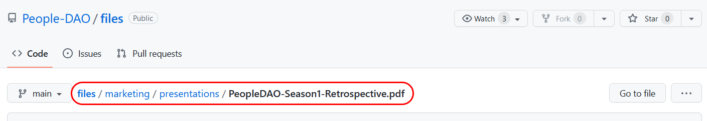

# Files

The PeopleDAO's files repository with [website](https://people-dao.com) routing support.

## How to use

You can link any files in the repository using the `https://people-dao.com/` address followed by file location path:

1. Upload the target file to desired location in the repository.
2. Navigate to the file through GitHub's GUI.
3. Copy the file path from breadcrumb navigation located next to the branch dropdown selection.

   - Example:

     

4. Paste the path at the end of the PeopleDAO's website domain (`https://people-dao.com/`).
   - Example: `https://people-dao.com/files/marketing/presentations/PeopleDAO-Season1-Retrospective.pdf`
