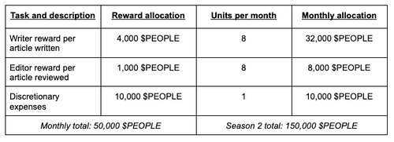

# PIP10: Writer Team Season 2 Budget Proposal

PIP9: Writer Team Season 2 Budget Proposal  
Core proposal  
Author: Tet#7609  
Reviewer: MatterTurbulent#5161  
Required Quorum: 100M $PEOPLE (if not exceeds the Quorum, the proposal will need to exceeds 90% of the votes to pass)  
Vote Duration: 5 days

The PeopleDAO Writer Team is a core component in the greater workings of PeopleDAO operations, vision, and mission. The Team dedicates itself to address the ever-increasing demand for insightful and entertaining write-ups. In particular, during Season 1 of PeopleDAO, the majority of the Team’s effort focused on producing educational and informative articles that could assist web3 users in understanding the governance and management of decentralized autonomous organizations (DAOs). This particular series was dubbed the DAOTOOL101 series and will continue onwards with its publication into Season 2 of PeopleDAO. The Writer Team is also responsible for inter-Teams coordination within PeopleDAO to copy, edit, and publish documents to forward PeopleDAO’s vision and mission.

The general purpose for this proposal is to rework the Season 2 budget proposal for the Writer Team, running from July 1st 2022 to September 30th 2022. In brief, the Writer Team will increase reward payout per article for each article written to both writers and editors. As such, the Writer Team will abandon the use of the Coordinape dApp and its 20,000 $PEOPLE reward pool allocation. Instead, this pool will be repurposed for discretionary expenses. Lastly, the Writer Team will establish the Research Club - a place to discuss and analyze the web3 ecosystem to produce better content for the people.

In order to achieve these goals, the Writer Team proposesthe following budget breakdown.

