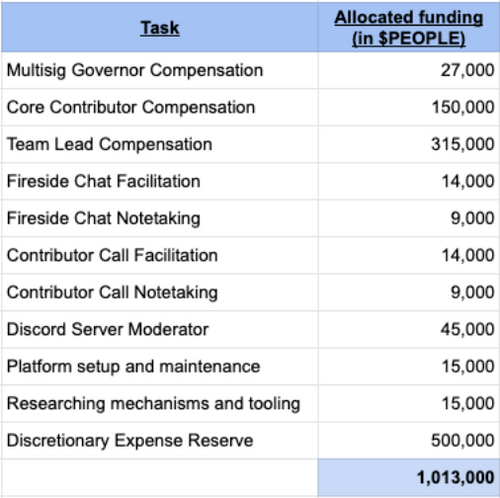
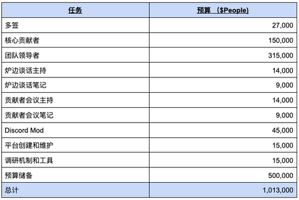

# PIP22: Formalize, Setup and Fund the PeopleDAO Operations Team (PIP22：正式建立和资助 PeopleDAO 运营团队)

Only through operational excellence can an organization capture remarkable opportunities.

PIP22: Formalize, Setup and Fund the PeopleDAO Operations Team  
Core proposal  
Author: ifun#9490 & Tet#7609  
Reviewer: Core Team  
Required Quorum: 100M $PEOPLE (if not exceeds the Quorum, the proposal will need to exceeds 90% of the votes to pass)  
Vote Duration: 5 days

Required budget for the season: 1,013,000 $PEOPLE token

PeopleDAO has gone a long way since its founding in late 2021, following the failure of the first ConstitutionDAO team's auction. Until now, the DAO has relied on a large number of talented contributors to withstand market fluctuations, and PeopleDAO has discovered its vision and mission as a metaDAO at the hub of the People Ecosystem, offering public goods for web3 natives. We propose the formation of PeopleDAO's eighth Team, the Operations (Ops) Team, charged with improving organizational efficiency and making the DAO more effective in reaching its key performance indicators.

The new Ops Team is essentially a rebranding effort that brings various operations under a single and formalized umbrella.The new Ops Team supplants the old General Expenditure proposal's tasks and rewards. The original idea for General Expenditures was introduced in PIP15:  
https://snapshot.org/#/people-dao.eth/proposal/0xbea02e91ae863df7d32a1faabfd7f3a06496abc8f350c21ecf794676a421a0c6.

The Ops Team Season 3 duties:

1. Discord management and moderation; including bots, webhooks, and integrations.
2. Dework platform management for bounties and task delegation.
3. DAO information aggregation management on platforms such as Notion, bip.so and Sobol.
4. Weekly meeting facilitator and note taker management.
5. Multisignatory Governor, it’s election, and the treasury management
6. Identifying educational resources about DAO tools to enhance management and contributor experience, and in rare occasions self-producing these resources. Researching mechanisms and tooling geared towards DAO management and enhancing contributor experience - the prerequisite being an existing documentation is not readily available for the general public.
7. Ensuring the proper conduct and management of all contributors and their deserved reward, Core Contributor inclusive.

The Core Contributors will collectively act as leaders of the Ops Team. The Core Contributor, who is responsible for overseeing the Ops Team's operations, has no control over the Team and cannot influence its actions. They are tasked to ensure a seamless functioning for the Team's work and ensure fair play between all DAO contributors.

Season 3 Budget Proposal (Oct 1 to Dec 31)

Detailed budget breakdown: [Attachment 1](./PIP22-attachment1.pdf)

中文翻译:

一个组织只有通过卓越运营才能抓住非凡的机会。

PIP22：正式建立和资助 PeopleDAO 运营团队  
核心提案  
作者：ifun#9490 & Tet#7609  
审核者：核心团队  
法定票数：一亿$PEOPLE 代币（如果不满足最低法定代币，提案将需要超过 90% 的选票才能通过）  
投票时间：5 天

本季度所需预算：1,013,000 个$PEOPLE 代币

PeopleDAO 自 2021 年底在 ConstitutionDAO 团队拍卖宪法失败之后成立以来，已经走过了漫长的道路。到目前为止，PeopleDAO 依靠大量有才华的贡献者抵挡住了市场波动，并且 PeopleDAO 已经确认了它要成为 metaDAO 的愿景和使命来为 web3 用户提供公共产品。我们建议成立 PeopleDAO 的第八个团队，即运营 (Ops) 团队，来负责提高组织效率并帮助 DAO 更有效地达到其关键绩效指标。

新的 Ops 团队负责品牌重塑工作，并负责各种运营事务。新的 Ops 团队将取代旧的 General Expenditure 的任务和奖励， 出事的 General Expenditure 理念是在 PIP15 中引入的：  
https://snapshot.org/#/people-dao.eth/proposal/0xbea02e91ae863df7d32a1faabfd7f3a06496abc8f350c21ecf794676a421a0c6。

运营团队第 3 季职责：

1. Discord 的管理和运营，包括机器人、webhook 和集成。
2. Dework 的平台管理和赏金任务委派
3. Notion、bip.so、Sobol 等平台上的 DAO 信息聚合管理
4. 每周会议的主持人和记录员管理。
5. 多签治理、选举和国库管理
6. 寻找有关 DAO 工具的科普资料来帮助管理者和贡献者提升运营 DAO 的经验，并在极少数情况下需要自己原创一些资料。当现有资料不容易提供给公众时，研究面向 DAO 管理和增强贡献者体验的机制和工具。
7. 确保所有贡献者的有正确的行为准则， 管理包括核心贡献者在内的贡献者应得的奖励。

核心贡献者将共同担任 Ops 团队的领导者。 负责监督 Ops 团队运营的核心贡献者无法控制团队，也无法影响其做出的决定。他们的任务是确保运营团队工作能无缝运作，并确保所有 DAO 贡献者之间的公平。

第 3 季预算提案（10 月 1 日至 12 月 31 日）

预算细节：  
[Attachment 1](./PIP22-attachment1.pdf)
