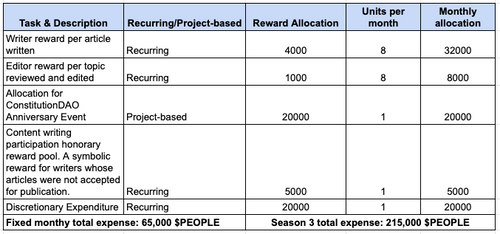

# PIP25: Writer Team Season 3 Budget Proposal

PIP25: Writer Team Season 3 Budget Proposal  
Author: Tet#7609  
Reviewer: koala#4988  
Required Quorum: 100M $PEOPLE (if not exceeds the Quorum, the proposal will need to exceeds 90% of the votes to pass)  
Vote Duration: 5 days

Total budget request: 215,000 $PEOPLE

In the Writer Team's season 2 activities, the level of community participation reached a record high. With the surge of great contribution ideas and article subjects to educate the public, the Writer Team presented the new competitive publishing model to prioritise quality above quantity. In the upcoming season 3 operations, we plan to enhance and improve this system. Consequently, the Team will concentrate on three primary publication categories: the original DAOTOOL101 series, the comprehensive educational web3 series, and the new $PEOPLe ecosystem series.

The original DAOTOOL101 series will continue, but will focus more on tooling that does not have a current instructional or official documentation. In the meantime, PeopleDAO should use the tools to qualify them for authoring and publication. The web3 series released in season 2 was a new educational series aimed at both web3 and web2 audiences. The objective of the web3 series was to report on the happenings in web3, break it down into non-technical language for the typical layperson to comprehend and consume, and thereby increase the accessibility of non-native web3 users and newcomers to the web3 environment. The newest introduced series is the $PEOPLE ecosystem series. This series will focus on providing content pertaining to PeopleDAO's core, including its seasonal goal, performance indicators, incubated projects, and subDAOs.

This season, the Writer Team will also be responsible for the ConstitutionDAO anniversary event being organised by PeopleDAO. ConstitutionDAO was a defining moment for web3 and the worldwide decentralised crowdfunding movement as a whole. Although the objective of buying a copy of the US Constitution document was not accomplished, the initiative's enthusiasm, coordination efforts, and significance are unmatched. For this anniversary event, the Writer Team will collaborate with the other Teams within the DAO to celebrate ConstitutionDAO's first anniversary.

As a result, the Writer Team would like to propose the following budget for its season 3 activities, from October 1, 2022 to December 31, 2022. The upper limit of the budget sits at 215,000 $PEOPLE token this season. However, the Team will operate in an efficient manner to conserve the expenses.

Voting choices:

1. Approve proposal.
2. Deny proposal.

---

PIP25:写作团队第三季预算提案  
作者： Tet#7609  
评论家：koala#4988  
所需法定人数：1 亿$PEOPLE（如未超过法定人数，提案需超过 90%票数方可通过）  
投票持续时间：5 天

总预算要求：215,000 $PEOPLE 代币

在编剧团队第二季的活动中，社区参与度达到历史新高。随着大量贡献理念和文章主题涌向大众，作家团队提出了新的竞争性出版模式，将质量置于数量之上。在即将到来的第 3 季中，我们计划加强和改进这个系统。因此，该团队将专注于三个主要出版物类别：原始的 DAOTOOL101 系列，全面的 web3 教育系列和新$PEOPLE 生态系统系列。

最初的 DAOTOOL101 系列将继续，但将更多地关注没有当前教学或官方文档的工具。同时，PeopleDAO 应使用这些工具使其有资格进行创作和发布。第 2 季发布的 web3 系列是针对 web3 和 web2 受众的新教育系列。Web3 系列的目的是报告 web3 中发生的事情，将其分解为非技术语言，供典型的外行人理解和使用，从而增加非本机 web3 用户和 web3 环境新手的可访问性。最新推出的系列是$PEOPLE 生态系统系列。本系列将重点提供与 PeopleDAO 核心相关的内容，包括其季节性目标、绩效指标、孵化项目和子 DAO。

本季，作家团队还将负责由人民道组织举办的宪法 DAO 周年纪念活动。宪法 DAO 是 web3 和整个全球分散式众筹运动的决定性时刻。虽然购买美国宪法文件副本的目的没有实现，但该倡议的热情和协调努力，和重要性是无与伦比的。对于这个周年纪念活动，作家团队将与 DAO 内的其他团队合作，庆祝宪法 DAO 成立一周年。

因此，写作团队希望为 2022 年 10 月 1 日至 2022 年 12 月 31 日的第 3 季活动提出以下预算。本赛季预算的上限为 215000$PEOPLE 代币。但是，该小组将以有效的方式运作，以节省开支。

投票选择:

1. 批准提案。
2. 拒绝提案。
