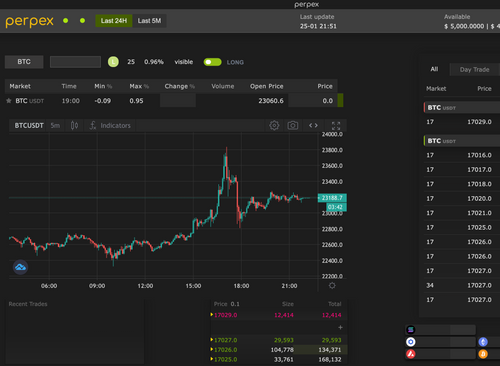

# PIP35: Second Perpex Investment

Author: MatterTurbulent#5161  
Required Quorum: 100M $PEOPLE (if votes don’t reach the quorum, the proposal will need to exceed 90% approval to pass).  
Vote Duration: 5 days

Proposal Summary:

PeopleDAO is incubating Perpex, a perpetual futures exchange integrating regenerative mechanisms. The project seeks additional funding to complete its product development. Perpex is currently in alpha testing with a closed group of traders. If PeopleDAO votes to approve additional funding then the DAO will receive a greater share of Perpex governance tokens and fundraising share once the protocol decentralizes.
Project Updates

PeopleDAO gave Perpex initial seed funding of 200K $PEOPLE back in June. The development team created a working alpha version of the exchange.

Product testers can do actions like:

- Monitor prices
- Place multiple limit orders simultaneously
- Go long or short
- Customize their trading dashboard
- Generally experience the user interface

Looking forward, we’re putting further energy into the UX/UI to make a product that’s customizable and feels familiar to traders from multiple backgrounds. We’re building out the margin system. Lastly, we are integrating the regenerative mechanisms, routing trading fees to fund public goods and more.

Requesting Additional Funding:

Perpex and the Incubator program are seeking an additional 200K $PEOPLE to complete the development of the application, and move to a more open beta testing. The 200K $PEOPLE will be used for the following purposes:

Hardware cost = 100K $PEOPLE  
On-going front and back-end development = 100K $PEOPLE

Revised Roadmap:

The original roadmap projected completion of the application in Q3 2022 and governance decentralization in Q4. Development has taken longer than expected, and the Constitution auction this Fall reduced the bandwidth of PeopleDAO staff. The new roadmap:

Complete Alpha Development - February 28  
Public Beta Opens - March 1  
Fundraising Starts on Juicebox - April 1

Investment Terms:

Under the original seed funding terms, Perpex would give PeopleDAO 5% of the forthcoming governance token and 5% of the ETH accrued during the fundraise. Should the PeopleDAO community approve this second batch of seed funding then the new terms will be changed to 6.5% of the Perpex governance token and 6.5% of ETH raised.

Vote YES to approve the 2nd investment  
Vote NO to reject this proposal
