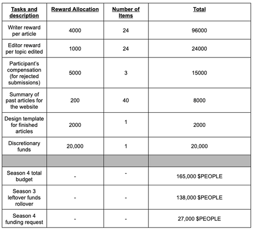

# PIP38: Writer Team Season 4 Budget Proposal

PIP38: Writer Team Season 4 Budget Proposal  
Core proposal

Author: Faevy#6563  
Reviewer: Tet#7609  
Required Quorum: 100M $PEOPLE (if not exceeds the Quorum, the proposal will need to exceeds 90% of the votes to pass)  
Vote Duration: 5 days

Total budget estimate: 165,000 $PEOPLE  
Budget rollover from season 3: 138,000 $PEOPLE  
Budget request for season 4: 27,000 $PEOPLE

In the last season, the Writer Team started using a method called "competitive writing." It has been using this method through Dework to assign tasks to its contributors. It's been a success so far, as we’ve had a lot of participation. The team has since adopted the use of Dynobot to welcome anonymous topic suggestions, after which suitable topics are chosen after a round of review. In season 3, we recorded a total of 15 article submissions via Dework; although this is below the estimated output amount, we encountered issues with repetitive topic suggestions by the writers. This made it hard to meet the original goal of publishing eight articles each month.

However, in December, the writing tasks were moved to January (season 4) as a result of a delay in topic suggestions, which by extension delayed the selection process. In an effort to receive quality work over quantity, the writers were given the usual deadline of 3 weeks to complete their articles, which caused the extension into season 4. Therefore, the team did not make use of funds allocated for the month of December as there were no activities.

Moreso, contributors whose articles were not selected after submission were compensated with a token, while the selected ones were either merged or approved individually. We encourage contributors and team leads to utilize some of the DAO tools that were needed, just as the Legal Team worked on using OpenLaw and Kleros DAO tools as suggested by the Writer Team in season 3.

This season, the Writer Team will continue its use of Dynobot for topic suggestions and its competitive writing system to select the best articles. The team will also include a template design for both previous and future topics to ensure everyone takes note of the finished articles. For the PeopleDAO website, we hope to produce an abstract summary for each finished article that has been produced thus far.

As a result, the Writer Team would like to propose the following budget for its season 4 activities, from January 1, 2023, to March 31, 2023: The upper limit of the budget sits at 165,000 $PEOPLE tokens this season. However, the Writer Team will operate in an efficient manner to conserve expenses. With a leftover estimate of 138,000 $PEOPLE tokens from season 3, the Writer Team would like to roll over these leftovers into its season 4 budget and request an additional 27,000 $PEOPLE tokens, thereby meeting its estimated budget expense of 165,000 $PEOPLE tokens for its season 4 activities.

A clear breakdown of the Writer Team’s season 4 activities can be viewed in table below.

