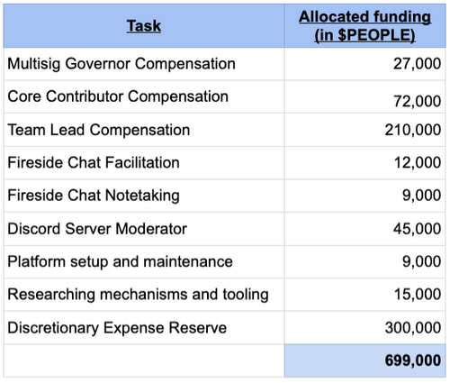

# PIP40: Ops Team Season 4 Budget Proposal

PIP40: Ops Team Season 4 Budget Proposal  
Core proposal  
Author: ifun#9490  
Reviewer: Tet#7609  
Required Quorum: 100M $PEOPLE (if not exceeds the Quorum, the proposal will need to exceeds 90% of the votes to pass)  
Vote Duration: 5 days

Required budget for the Season: 699,000 $PEOPLE

Team Deliverables:

Building on what work has been done and those that are ongoing, we propose, but not limited to the following deliverables;

- Discord management and moderation; including bots, webhooks, and integrations.
- Dework platform management for bounties and task delegation.
- DAO information aggregation management on platforms
- Weekly meeting facilitator and note taker management.
- Multisignatory Governor, it's election, and the treasury management
- Identifying educational resources about DAO tools to enhance management and contributor experience, and in rare occasions self-producing these resources. Researching mechanisms and tooling geared towards DAO management and enhancing contributor experience - the prerequisite being an existing documentation is not readily available for the general public.
- Ensuring the proper conduct and management of all contributors and their deserved reward, Core Contributor inclusive.

Team Structure:

Going forward in Season 4, the Ops Team will be led by the Tet#7609 and assisted by ifun#9490 who will stand in as a co-lead for the Ops team to ensure operations are streamlined.

Season 4 budget proposal tabular summary (JAN 1 – MAR 31):

Detailed budget breakdown can be found here:  
[Attachment 1](./PIP40-attachment1.pdf)

Voting choice:

1. Approve the proposal.
2. Reject the proposal.
