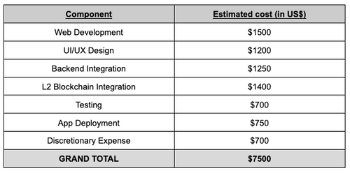

# PIP9: SubDAO Incubation: Perpetual DAO - A SubDAO Governing the PEDEX DeFi Platform

Incubation proposal  
Author: Tet#7609  
Reviewer: Incubation Committee  
Required Quorum: 100M $PEOPLE (if not exceeds the Quorum, the proposal will need to exceeds 90% of the votes to pass)  
Vote Duration: 5 days

Perpetual Decentralized Exchange, PEDEX, is an up and coming DeFi platform that will be governed by the Perpetual DAO subDAO. This project is under the lead of Niffo, a forex and crypto trader, and developer. The project believes that blockchain technology can increase access to financial instruments, unlocking new economic opportunities for worldwide participants. The mission of PEDEX, and Perpetual DAO, is to open up a DeFi platform to everyone that facilitates the trading of perpetual futures. The key advantage of said platform will be its superior UX/UI design, as well as providing functionalities that many DeFi protocols lack in today’s markets. A brief feature description can be found below:

- Placing bulk Limit orders through clicking on the order book
- Pre-defined Take Profit, Stop Loss with Limit and Market orders
- Multi-updating of Take Profit and Stop Loss orders
- Trading directly from the order book
- Adding widgets on the home screen and free moving
- Managing multiple trade accounts by easy switching

Perpetual DAO would like to request a funding amount of $7,500 USD in total to help its development. The PEDEX platform will utilize the bulk of the funding of $7,500 USD, in its blockchain-integrated development operation for a functioning demo dApp and website in Q3 2022. The cold start funding will help the PEDEX team to further the development of the platform and hire new blood focused on blockchain-integration tasks, as well as frontend development. The detailed breakdown are as follows:

Post-development in Q4 2022, the PEDEX platform and its governing subDAO, Perpetual DAO, will organize a seed round to accumulate additional funding when a functional dApp is produced. Said seed round funding will be conducted on Juicebox - where 5% of the funding $ETH and Perpetual DAO’s governance token will be delegated to the People DAO Treasury. In addition to this, Perpetual DAO will also set up a donation platform known as The Foundation, where all donation proceeds will be given to the People DAO Treasury to help incubate future projects. The donation for this foundation will come from 1% of all transaction fees revenue on the PEDEX platform, as well as altruistic donors from around the world. Lastly, a separate portion of the trading fees, valued at 1%, will be provided to People DAO in support of its development.

The distinction between these two streams of constant funding (i.e. from the Foundation, and from the trading fees) is to differentiate the charitable narrative, and the profit narrative. Donation from the Foundation is solely for incubation purpose, whereas returns derived from the trading fees is a return on investment for People DAO. The latter can be used for any financial purpose by the People DAO community, incubation inclusive.

The detailed proposal can be found here, together with a Chinese version: [Attachment 1](./PIP9-attachment1.pdf)

Voting choice:  
Choice 1: Yes, fund Perpetual DAO & PEDEX.  
Choice2: No, do not fund Perpetual DAO & PEDEX.
